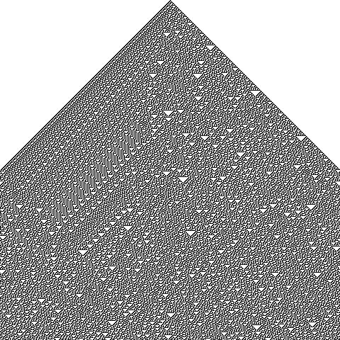
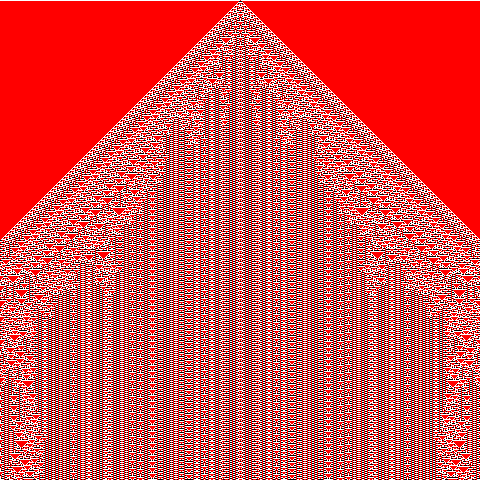
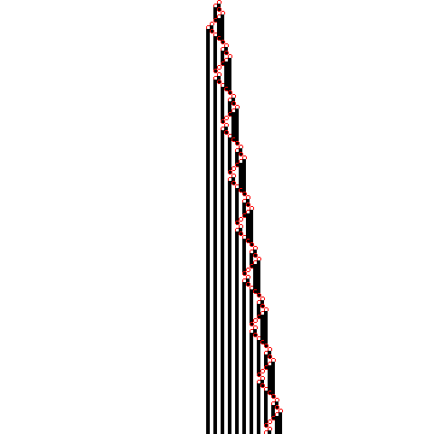
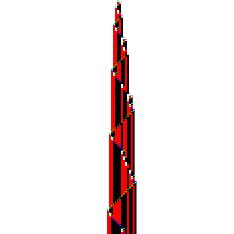

# nks

A **New Kind of Science** - cellular automata (CA). Inpired by Steven Wolfram's book *A New Kind of Science*

**Note: This project is currently in development, and there may be bugs. Please use with caution and report any issues you encounter.**

## Table of Contents

1. [Introduction](#introduction)
2. [Features](#features)
3. [Installation](#installation)
4. [Usage](#usage)
5. [Examples](#examples)
6. [License](#license)
8. [Conclusion](#conclusion)

## Introduction

This program is designed to simulate and visualize cellular automata. Cellular automata are computational models that exhibit dynamic behavior emerging from the local interaction of cells arranged in a regular lattice. This README provides general information about the program and instructions for usage.

## Features

The *nks* program offers the following features:

* **Cellular Automata Simulations**: The program allows you to simulate various types of cellular automata, each governed by different rules and behaviors.

* **Visualization**: The program provides a graphical interface to visualize the cellular automata simulations in real-time.

* **Rule Customization**: You can customize the rules and parameters of the cellular automata simulations to explore different patterns and behaviors.

## Installation

To use the `nks`, follow these steps:

1. **Download**: Download and install [SDL2](https://www.libsdl.org/) library.
2. **Download**. Download and install `nks`:
   * Open your terminal or command prompt.
   * Navigate to the directory where you want to clone the repository.
   * Type the following command to clone the repository: `git clone https://github.com/paul-green-stone/nks.git`.
   * Wait for the repository to be cloned to your local machine.
   * Once the cloning process is complete, you can navigate to the cloned repository directory and start working on it.
3. **Update**. Initialize and update all dependencies:
   * Open your terminal or command prompt.
   * Navigate to the directory where you have cloned the `https://github.com/paul-green-stone/nks.git` repository.
   * Type the following command to initialize the submodule: `git submodule init`.
   * Wait for the submodule to be initialized.
   * Once the initialization process is complete, type the following command to update the submodule: `git submodule update`.
   * Once the update process is complete, you can navigate to the submodule directory and start working on it.
4. **Run**: Invoke `nks -h` command for further instructions.

## Usage

Once the `nks` is installed, you can use it to display and simulate different rules of cellular automata. Here are the general steps to use the program:

1. **Configure**: Set up the initial state, rules, and parameters of the cellular automata simulation. This may involve specifying the lattice structure, neighborhood type, and the specific rule to be applied.

2. **Run**: Start the simulation to observe the evolution of the cellular automata over time. The program will update the visualization in real-time.

3. **Interact**: Depending on the program's capabilities, you may be able to interact with the simulation during runtime. This could include pausing, resetting, or modifying the simulation parameters.

4. **Analyze**: Analyze the patterns and behaviors that emerge from the cellular automata simulation. Observe how changes in the initial state or rules affect the overall dynamics.

## Examples

To help you get started, here are a few examples of cellular automata simulations you can try with the *nks*:

1. **Elementary**. A type of one-dimensional cellular automaton that consists of a row of cells, each of which can be in one of two states (0 or 1). The automaton evolves over time according to a set of rules that determine the state of each cell based on its current state and the states of its two neighbors. There are 256 possible elementary automaton rules, each of which can be represented by an 8-bit binary number.

2. **Totalistic3**. A type of cellular automaton where the new color of each cell depends only on the average color of its neighboring cells, rather than their individual colors. There are 2187 possible totalistic rules for a `TOTALISTIC3` (*r = 3*) automaton, each of which can be identified by a code number. The specific behavior and patterns of the automaton depend on the chosen rule and initial conditions.

3. **Mobile Automata**. Mobile automata are similar to cellular automata except that instead of updating all cells in parallel, they have just a single “active cell" that gets updated at each step - and then they have rules that specify how this active cell should move from one step to the next.

4. **Turing machine**. A mathematical model of computation describing an abstract machine[1] that manipulates symbols on a strip of tape according to a table of rules

Please note that the exact behavior and patterns of an elementary automaton may vary depending on the chosen rule and initial conditions.

## License

This project is licensed under the MIT License.

## Conclusion

The *nks* provides a platform for displaying and simulating different rules of cellular automata. By exploring various initial states and rules, you can observe the emergence of complex patterns and behaviors. Use this *README* as a guide to install, use, and experiment with the program. Enjoy exploring the fascinating world of cellular automata!
